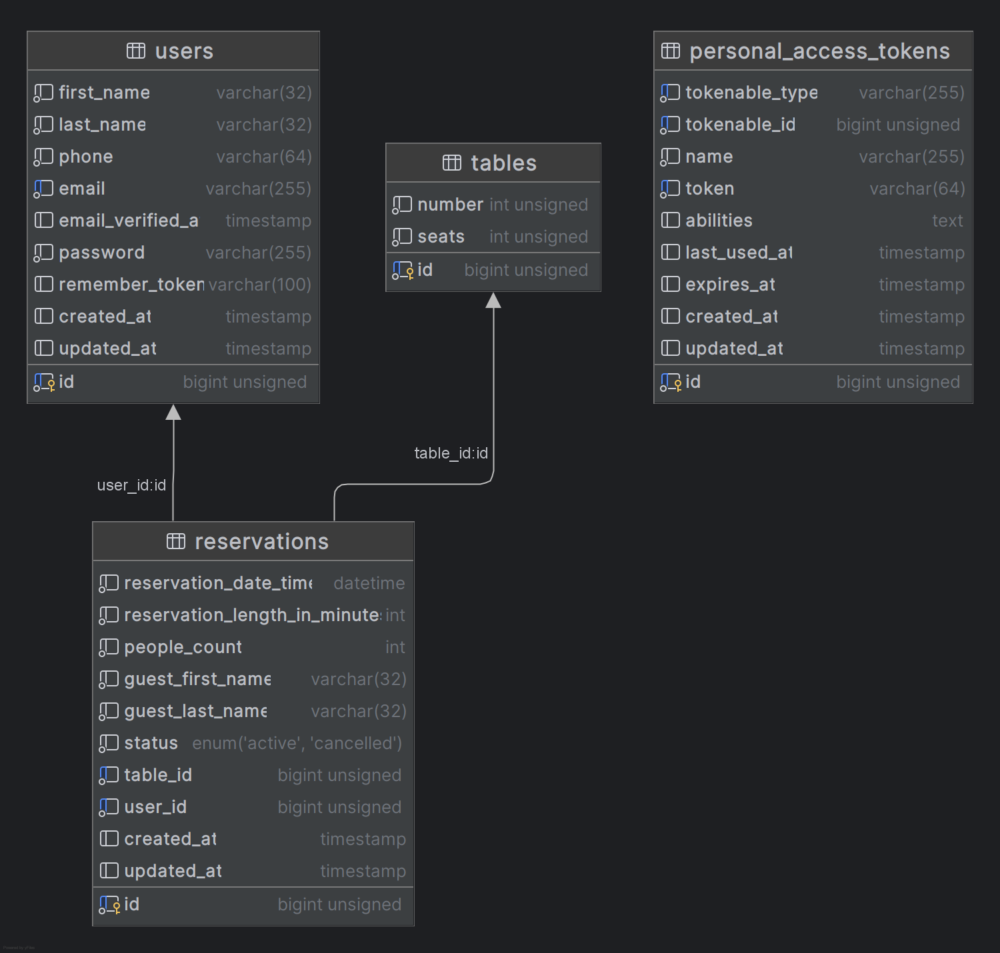

# SNADNEE Laravel assignment

Project is built as a monorepo containing two applications.

## Back end
`snadnee-assignment-api` contains API implemented in Laravel 11.
API is RESTful. Authentication is implemented using Sanctum with 
bearer tokens.

Database schema is following.

## Front end
`snadnee-assignment-fe` contains front end single page application implemented in Vue.js 3.
Front end app contains login and registration abilities. Logged users can search for 
free tables, create new reservations or cancel existing.\
Reserved tables are shows as red, available shows as gray. After you create an account you can find
red able by selecting next day 18:30.

## Running
Whole infrastructure can be started by simple `docker compose up` command. Docker build handles
server setup, vendor installation, database migration, database seeding and front end building.

You can access adminer at http://localhost:8081 \
Front end: http://localhost:8080 \
Back end: http://localhost:8083

First build can take a while!
## Testing
You can run tests in container using `docker compose exec php_api ./vendor/bin/phpunit`
or in local system with installed PHP using `./snadnee-assignment-api/vendor/bin/phpunit`